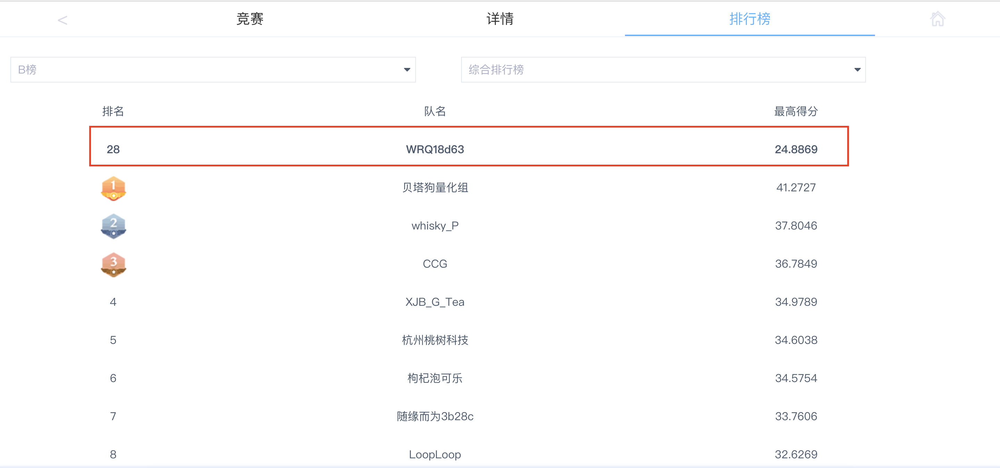
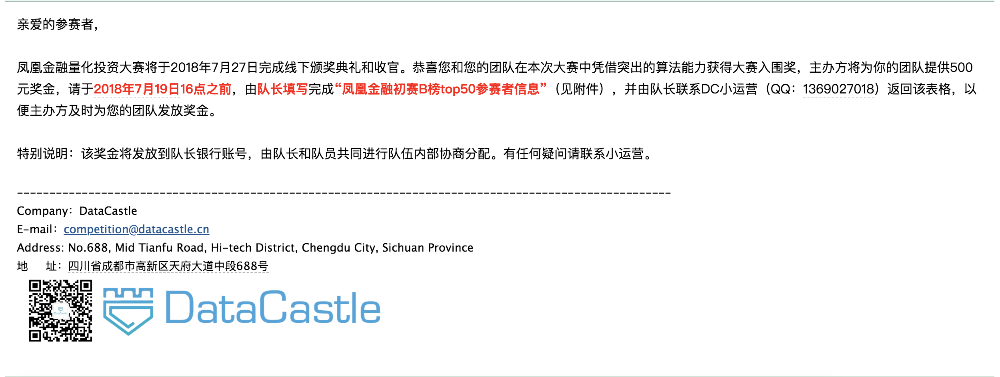

<!-- README.md is generated from README.Rmd. Please edit that file -->

```{r setup, include = FALSE}
knitr::opts_chunk$set(
  collapse = TRUE,
  comment = "#>"
)
```

1. 比赛: 凤凰金融 (Phoenix Finance) 量化投资大赛
1. 需求: 预测各股票未来半年收益率
1. 比赛中，做了多个模型进行尝试，但是sense不够强，最后只止步于入围，b榜第28名，[链接这里](http://www.dcjingsai.com/static_page/m/cp_rank.html?cmptId=204)。
1. 比赛排名如下





### 实现方式

我们主要的实现方式是

1. 主模型为 Xgboost
1. 进行了手动融合 (stacking)
1. 做了历史上传记录的融合 (stacking) ，效果不好，大概原因是过拟合。

具体见[Blog](https://jiaxiangli.netlify.com/2018/06/03/phoenix-finance/)

### 特征工程

见[Blog](https://jiaxiangli.netlify.com/2018/06/03/phoenix-finance/)
2 数据处理

### 不足

相比于 [phv](https://github.com/JiaxiangBU/phv)，
这算是早期项目，因此我们没有尝试深度学习 (RNN相关) 模型。

另外参考
[预测值迁移](https://jiaxiangbu.github.io/channel_valuation/about)
的问题。

```{comment}
"DraftsExport-2022-04-10-01-08.Rmd"
```
但是考虑当时比赛[@phoenixfinance2018stock]，需要选择 top 50 的股票，这个预测思路类似 @bali2020the 的多空策略，

对每只股票估计OOT的收益率，然后切分10等分，对大盘卖出 bottom 10%，买入 top 10%。

但是初赛的表现期其实和训练集上的可能不是平稳的。这个问题可以拆解，

- 参考稳定学习[@cui2022stable]的思想，在训练集多做几个验证集，然后选择稳定在 top 50 的股票
- 参考 conformal inference 的方式，找到训练集中那个时期和测试集最相似，然后关注训练集这个时期的 top 50 的股票

然后把交集作为输出。


### 其他

readme 格式参考[github](https://github.com/JiaxiangBU/phv)

***

<h4 align="center">**Code of Conduct**</h4>

<h6 align="center">Please note that the 'phoenix-finance' project is released with a [Contributor Code of Conduct](CODE_OF_CONDUCT.md). By contributing to this project, you agree to abide by its terms.</h6>

<h4 align="center">**License**</h4>

<h6 align="center">GPL-3 &copy; [Jiaxiang Li;Ruiqi Wu;Xiaosong Jin](LICENSE)</h6>
