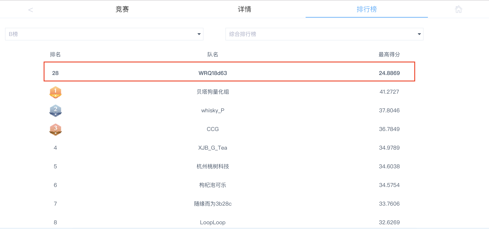
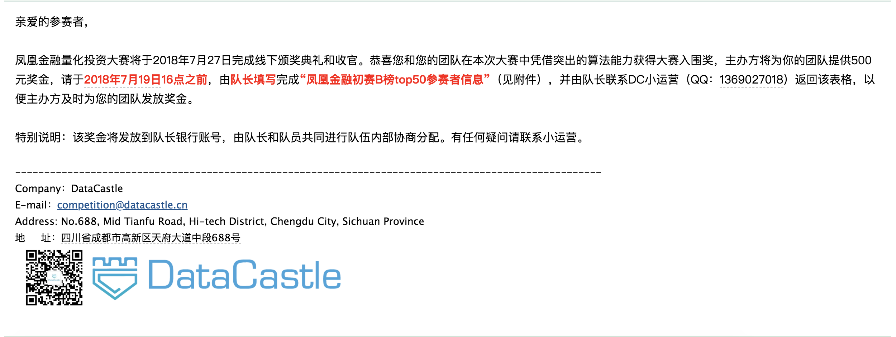

凤凰金融 (Phoenix Finance) 量化投资大赛 参赛笔记
================
李家翔,武睿琦,靳晓松
2022-04-10

<!-- README.md is generated from README.Rmd. Please edit that file -->

1.  比赛: 凤凰金融 (Phoenix Finance) 量化投资大赛
2.  需求: 预测各股票未来半年收益率
3.  比赛中，做了多个模型进行尝试，但是sense不够强，最后只止步于入围，b榜第28名，[链接这里](http://www.dcjingsai.com/static_page/m/cp_rank.html?cmptId=204)。
4.  比赛排名如下

### 实现方式

我们主要的实现方式是

1.  主模型为 Xgboost
2.  进行了手动融合 (stacking)
3.  做了历史上传记录的融合 (stacking) ，效果不好，大概原因是过拟合。

具体见[Blog](https://jiaxiangli.netlify.com/2018/06/03/phoenix-finance/)

### 特征工程

见[Blog](https://jiaxiangli.netlify.com/2018/06/03/phoenix-finance/) 2
数据处理

### 不足

相比于 [phv](https://github.com/JiaxiangBU/phv)，
这算是早期项目，因此我们没有尝试深度学习 (RNN相关) 模型。

另外参考
[预测值迁移](https://jiaxiangbu.github.io/channel_valuation/about)
的问题。

但是考虑当时比赛([凤凰金融
2018](#ref-phoenixfinance2018stock))，需要选择 top 50
的股票，这个预测思路类似 [Bali et al.](#ref-bali2020the)
([2020](#ref-bali2020the)) 的多空策略，

对每只股票估计OOT的收益率，然后切分10等分，对大盘卖出 bottom 10%，买入
top 10%。

但是初赛的表现期其实和训练集上的可能不是平稳的。这个问题可以拆解，

-   参考稳定学习([Cui and Athey
    2022](#ref-cui2022stable))的思想，在训练集多做几个验证集，然后选择稳定在
    top 50 的股票
-   参考 conformal inference
    的方式，找到训练集中那个时期和测试集最相似，然后关注训练集这个时期的
    top 50 的股票

然后把交集作为输出。

### 其他

readme 格式参考[github](https://github.com/JiaxiangBU/phv)

------------------------------------------------------------------------

<h4 align="center">
**Code of Conduct**
</h4>
<h6 align="center">
Please note that the ‘phoenix-finance’ project is released with a
[Contributor Code of Conduct](CODE_OF_CONDUCT.md). By contributing to
this project, you agree to abide by its terms.
</h6>
<h4 align="center">
**License**
</h4>
<h6 align="center">
GPL-3 © [Jiaxiang Li;Ruiqi Wu;Xiaosong Jin](LICENSE)
</h6>

Bali, Turan G., Amit Goyal, Dashan Huang, Fuwei Jiang, and Quan Wen.
2020. “The Cross-Sectional Pricing of Corporate Bonds Using Big Data and
Machine Learning.” *Swiss Finance Institute Research Paper Series*.

Cui, Peng, and Susan Athey. 2022. “Stable Learning Establishes Some
Common Ground Between Causal Inference and Machine Learning.” *Nature
Machine Intelligence* 4 (2): 110–15.

凤凰金融. 2018. “凤凰金融 (Phoenix Finance) 量化投资大赛.”
https://github.com/JiaxiangBU/phoenix-finance.

